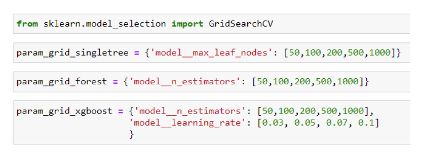
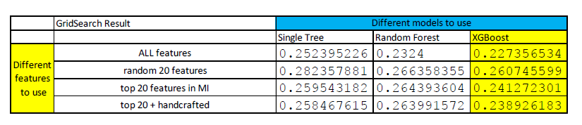
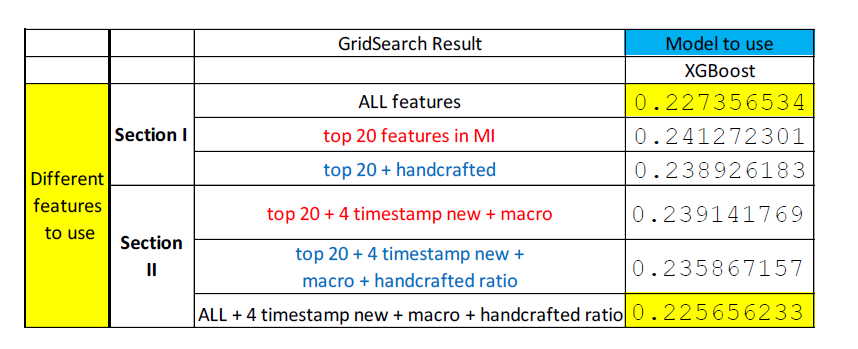

# Kaggle-Sberbank
# Project Introduction

Utilize ML models from scikit-learn to predict Russian reality prices. The interesting part in this project is that other than the detailed house information tied to the sold properties, the competition organizer Sberbank additionally provides Russia’s macroeconomic indicators as a complimentary feature set. As Russia is famous for its volatile economy, this brings extra challenges for the prediction task. An overview of the input dataset files is as followed:  

•	Train.csv: 292 feature columns with respect to each sold property       
•	macro.csv: 100 feature columns which are country’s macroeconomic indicators, arranged sequentially and has the same timeline as the sold property record       

The actual Kaggle competition link is https://www.kaggle.com/c/sberbank-russian-housing-market/     

There're in total 2 parts of experiments conducted in this project. The first section utilizes only the train.csv feature set, with the objective to determine the optimal feature engineering and ML model to use in an effective scale-down environment. The second part will combine the additional macro features on top of the optimal solution obtained in the first part.    

# Experiment I

All the different feature engineering techniques attempted are:    

•	Simply input all the features     
•	Pick random 20 features from train.csv      
•	Pick top 20 features in MI (Mutual Information) metric       
•	Use 20 features in MI + some handcrafted features        

The handcrafted features are constructed based on the observation that most of the top MI scored features are population counts in the house neighbourhood. Since the population counts have a very high correlation with the predict target, and generally in ML practise creating new features as ratio will benefit model performance, new columns representing the corresponding female or male ratio in the neighbourhood are created.      

All the different ML models attempted are:   
 

•	Single Decision Tree      
•	Random Forest      
•	XGBoost      

The intuition for selecting them is that they are all tree-based (assuming XGBoost uses ‘gbtree’ as its booster) so comparing their performances could generate a clear understanding of how ensemble model performs vs. a single model for this dataset.      
To accurately evaluate the results, every combination will undergo hyperparameter search which is achieved by the GridSearchCV in scikit-learn. The parameter lists for all the models are shown as below:       

The final result for the 1st section experiment is: (the scoring metric is NMSLE: neg_mean_squared_log_error, so lower is better)      

The conclusion is that the XGBoost model is consistently best model choice. In terms of feature engineering, it is a little bit surprising though that using ALL the features actually performs the best. Using top 20 features in MI doesn’t deliver better results than using the ALL features, but it is still significantly better than just using 20 random features. When adding the extra handcrafted ratio features on top of the top 20 features, the performance increase, which proves that the manually created ratios are helpful for the data prediction. As a result, the takeaway of the first section experiment is that: in the following Section II experiment, the feature engineering to used is ALL features + handcrafted ratio features; the model to use would be XGBoost model.      

# Experiment II

In this part, the macroeconomic features from macro.csv file will be added to further aid the price prediction. Although there’re in total 100 macro features in the file, inputting all of them would adversely degrade the model performance. The reason is that many of the macro features are highly intercorrelated. Alternatively, the optimal solution here is to utilize “variance inflation factor” to filter out 13 helpful features.      

Besides 13 macro features, something extra can be introduced into the formula. The intuition for this feature engineering is that economic trend is usually related to the time of the year, for example, economy may depend on whether it is at the start of a year or it is at the end of a year. As a result, 4 new features will be crafted as followed:   
 

•	Month_year_count: counts the occurrence of a specific year-month combination in the timestamps     
•	Week_year_count: counts the occurrence of a specific year-week combination in the timestamps     
•	Month: indicates which month of the year     
•	Dow: indicates which day of the week     

The final experiment results are:     

After apply the best model setup on the test dataset and submit the predictions to Kaggle, the Kaggle leaderboard score is:       

  

  
  

  

 
